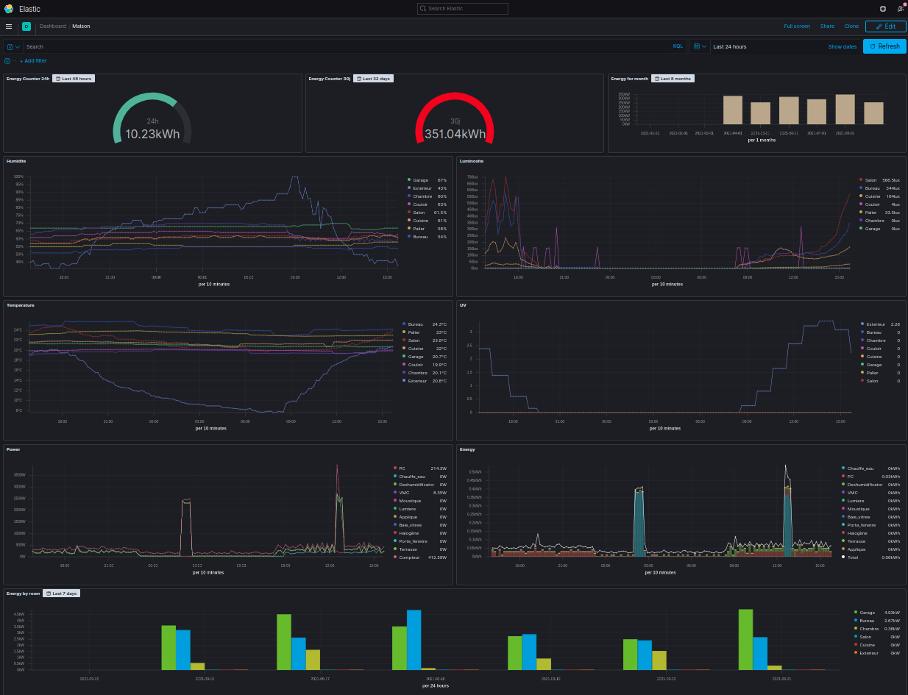

# fibaro-dashboard

Collect climate (temperature, humidity, lux, uv) and power information from Fibaro Home Center 3.
Display this information with [Kibana](https://www.elastic.co/kibana) Dashboard.

Collect links between ZWave devices in [Neo4J](https://neo4j.com/) from Fibaro Home Center 3.

## Requirement

To install Elasticsearch and Kibana on a Raspberry Pi, use:
[https://github.com/GuillaumeWaignier/ansible-raspberry-elasticsearch](https://github.com/GuillaumeWaignier/ansible-raspberry-elasticsearch)

To install Neo4J on a Raspberry Pi, use:
[https://github.com/GuillaumeWaignier/ansible-raspberry-neo4j](https://github.com/GuillaumeWaignier/ansible-raspberry-neo4j)

Install [Ansible](https://docs.ansible.com/ansible/latest/index.html) version 2.10 min


## Install

Then to install the cron job that collect the metric do

```bash
ansible-playbook domotique-play.yml --ask-pass
```

To change parameters, such as version, create the file as

```yaml
- name: Install metric collector
  hosts: collector
  roles:
    - role: collector
      tags: collector
  vars:
    - cronMinute: "*/5"
    - fibaro_login: "stats"
    - fibaro_url: "http://192.168.2.13"
    - kibana_url: "http://localhost:5601"

  vars_prompt:
    - name: fibaro_password
      prompt: fibaro password
    - name: neo4j_password
      prompt: Neo4j Password
```

The host(s) of the PI are in file _hosts/inventory_.

For the climate, the user needs the access to:
* Temperature sensor
* Humidity sensor
* Light sensor
* Uv sensor

For the power and energy, the user needs the access to:
* power device
* energy device

## Dashboard Kibana



## Neo4J Dashboard

To collect the links between zwave device, do:

```bash
/elk/fibaro/fibaro_zwave_graph.sh
```


